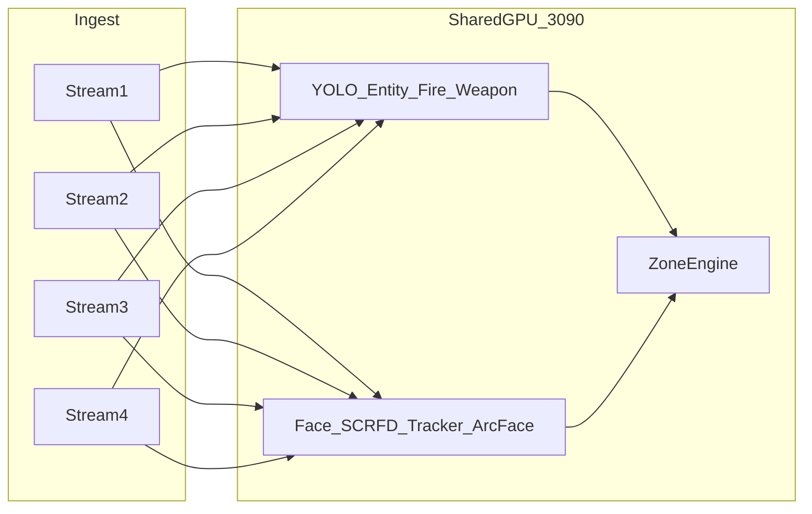

# Facial Recognition — Feasibility Evaluation

Evaluation of [FACIAL_REC.md](FACIAL_REC.md) against the Vision Demo context ([PLAN.md](PLAN.md)): 4 concurrent streams, RTX 3090 24GB, shared GPU with entity/fire/weapon YOLO models and zone logic.

**Verdict: Feasible for demo** using **Option B** (InsightFace + ONNX Runtime GPU + lightweight tracker), with staged integration and measured budgets. Not feasible to run all models at full per-frame rate on every stream without batching and tracker gating.

---

## 1. Stack recommendation (test pipeline)

| Stage | FACIAL_REC.md spec | Test pipeline choice | Rationale |
|-------|-------------------|----------------------|-----------|
| Deploy path | Option B for demo | **Option B** | Faster iteration, Python-native, fits FastAPI server; DeepStream deferred |
| Face detector | SCRFD-10GF default | **SCRFD-10G via InsightFace `buffalo_l`** | Same family; `det_10g.onnx` bundled in pack; 34GF benchmarked later |
| Tracker | ByteTrack or NvDCF | **IoU tracker (test)** → ByteTrack in integration | Sufficient for gating recognition calls; swap without API change |
| Recognizer | buffalo_l (w600k_r50) | **buffalo_l ArcFace embeddings** | Off-the-shelf, ~512-dim, well-supported |
| Runtime | FP16 TensorRT | **ONNX Runtime CUDA (FP16 where supported)** for test; TensorRT export in Phase 2 | ORT ships faster for demo; TRT when VRAM tight |
| Gallery | cosine similarity | **In-memory + JSON file** | Demo scope; no vector DB |

Test pipeline location: `server/facial_rec/` + `scripts/run_facial_rec_test.py`.

---

## 2. Shared GPU budget (24GB RTX 3090)

Estimated VRAM when co-resident with main demo pipeline:

| Component | FP16 / shared instance | Notes |
|-----------|------------------------|-------|
| YOLO entity (yolo11m) | ~1.5–2.5 GB | One instance, batched 4 streams |
| YOLO fire + weapon | ~1–2 GB combined | Smaller custom weights |
| SCRFD-10G detector | ~0.3–0.5 GB | Single shared engine |
| buffalo_l recognizer | ~0.5–1.0 GB | Single shared engine |
| Activations (4×1080p batch) | ~2–4 GB | Depends on batch size and det_size |
| Decode / frame buffers | ~1–2 GB | NVDEC reduces CPU copy pressure |
| **Total (rough)** | **~6–12 GB** | Leaves headroom on 3090 if batching bounded |

**Risks to VRAM feasibility**

- Loading **per-stream model copies** (4× detector) — avoid; spec already requires shared instances.
- Running **recognition every frame every face** — avoid; tracker must gate (main lever).
- Defaulting to **SCRFD-34GF + antelopev2** preemptively — defer unless 10G fails on footage.
- Building **TensorRT engines with unbounded workspace** — cap batch at 4–8.

**Conclusion:** VRAM feasible with FACIAL_REC.md defaults (10GF + buffalo_l, shared, FP16, tracker-gated recognition).

---

## 3. Throughput feasibility (4 × 15–30 FPS)

| Factor | Impact |
|--------|--------|
| Tracker gating | Recognition at track create + every N frames (e.g. 5–15) cuts embed cost 5–15× |
| det_size 640×640 | Good balance for workplace distance; 1280 only if small-face recall fails |
| Batched inference | Mux frames from 4 streams → one detector forward pass |
| Main demo YOLO load | Entity/fire/weapon share same GPU time slice; adaptive FPS scheduler helps |
| YouTube ingest | Decode latency variable; not a face-model limit but affects end-to-end FPS |

**Reference (directional, isolated, 3090):** buffalo_l det+rec ~hundreds of FPS at 640×480 batch=1. End-to-end 4-stream pipeline target **15 FPS/tile** is achievable if:

1. Face detection runs at 10–15 Hz per stream (tracker interpolates boxes), or
2. Full detection at 15 FPS with recognition gated by tracker.

**Conclusion:** 15 FPS/tile annotated demo is **achievable**; 30 FPS/tile on all 4 simultaneously with full YOLO suite + face at full rate is **unlikely** without prioritization — use adaptive scheduler from PLAN.md.

---

## 4. Accuracy feasibility (workplace, non-cooperative)

| Challenge | Mitigation in demo |
|-----------|-------------------|
| Distant / small faces | SCRFD-10G first; escalate to 34G only if recall insufficient |
| Profile / off-angle | buffalo_l acceptable for demo; antelopev2 fallback |
| YouTube compression artifacts | Expect lower recall; document in demo |
| No fine-tuning | Gallery enrollment from 1–3 clear photos per person; threshold tuning |

**Conclusion:** Demo-grade identification of enrolled staff is feasible; forensic-grade accuracy is explicitly out of scope.

---

## 5. Integration with main demo (PLAN.md)



- Face pipeline runs as **optional module** (`server/facial_rec/`) invoked from main `inference/pipeline.py` when enabled in `.env`.
- Alerts: `face.recognized`, `face.unknown` alongside `zone.intrusion`, `fire.detected`, `weapon.detected`.
- UI: face labels on bounding boxes in stream tiles (Phase after test validation).

---

## 6. Gaps and validation checklist

| Item | Status | Action |
|------|--------|--------|
| SCRFD-10G vs 34G on workplace footage | Open | `run_facial_rec_test.py compare-det` (future flag) |
| End-to-end 4-stream FPS + VRAM | Open | `run_facial_rec_test.py multistream --benchmark` |
| buffalo_l vs antelopev2 off-angle | Open | Manual review on test clips |
| TensorRT FP16 engines | Deferred | After ORT baseline measured |
| ByteTrack vs IoU tracker | Open | IoU in test pipeline; ByteTrack when integrating |
| Co-run with 3× YOLO | Open | Joint benchmark after main pipeline exists |

---

## 7. Decision summary

| Question | Answer |
|----------|--------|
| Is facial rec feasible in this demo? | **Yes**, with Option B and shared-GPU discipline |
| Recommended stack for test pipeline? | **InsightFace buffalo_l + SCRFD-10G + IoU tracker + cosine gallery** |
| Blockers? | None for test pipeline; joint VRAM/FPS must be **measured** on 3090 |
| DeepStream now? | **No** — defer to production scale-out |
| Custom training? | **No** — per FACIAL_REC.md demo scope |

Run the test pipeline:

```bash
cd demo-app
pip install opencv-python-headless insightface onnxruntime-gpu numpy
python facial_rec_video_test.py --input clip.mp4 --output data/facial_rec/output/annotated.mp4
```

Optional gallery folder `data/facial_rec/gallery/<Name>/photo.jpg` for named recognition.
