# Pipeline and Data Flow Architecture

This document details the visual and logical relationships between **Stream Ingestion**, **Adaptive GPU Inference Pipeline**, **Recording**, **Per-Camera Model Switches**, and the **React Dashboard** as specified in the [PLAN.md](file:///c:/Programming/Projects/03_PROTOTYPE/rapideye_prototype/rapideye-demo/PLAN.md).

## Architecture Diagram

```mermaid
flowchart TB
    %% ---------------------------------------
    %% STYLES & INTERFACES
    %% ---------------------------------------
    classDef inputStyle fill:#2A2D34,stroke:#4E5D6C,stroke-width:2px,color:#FFFFFF;
    classDef backendStyle fill:#1E293B,stroke:#38BDF8,stroke-width:2px,color:#F8FAFC;
    classDef inferenceStyle fill:#14532D,stroke:#4ADE80,stroke-width:2px,color:#F0FDF4;
    classDef frontendStyle fill:#311B92,stroke:#B388FF,stroke-width:2px,color:#EDE7F6;
    classDef storageStyle fill:#78350F,stroke:#F59E0B,stroke-width:2px,color:#FEF3C7;
    classDef dbStyle fill:#4C1D95,stroke:#A78BFA,stroke-width:2px,color:#F5F3FF;

    %% ---------------------------------------
    %% INPUT LAYER
    %% ---------------------------------------
    subgraph Inputs ["Stream Ingestion (4 Hardcoded Video Feeds)"]
        YT["Local Assets Folder (assets/camera_*.mp4)"]:::inputStyle
        FF["CV2 File Decoders (Independent Threads)"]:::inputStyle
        YT --> FF
    end

    %% ---------------------------------------
    %% BACKEND SERVICE (FastAPI)
    %% ---------------------------------------
    subgraph Backend ["FastAPI Server Backend"]
        direction TB

        subgraph IngestPipe ["Ingestion & Scheduling"]
            Buf["Per-Camera Ring Buffer (10s Pre-Alert Deque)"]:::backendStyle
            Sched["Adaptive FPS Scheduler (Rebalances FPS based on activity)"]:::backendStyle
        end

        subgraph ModelControl ["Per-Camera Model Switches"]
            Switches["Model Switch Manager\n(fire / weapon / face toggles)"]:::backendStyle
        end

        subgraph InfPipeline ["GPU Inference Pipeline (RTX 3090)"]
            direction LR
            YOLO_Ent["YOLO Face / Entity Detection\n(COCO — optional)"]:::inferenceStyle
            YOLO_Fire["YOLO Fire & Smoke Detection\n(Custom Weights)"]:::inferenceStyle
            YOLO_Weap["YOLO Weapon Detection\n(Custom Weights)"]:::inferenceStyle
            Merge["Unified Result Merger"]:::inferenceStyle

            YOLO_Ent --> Merge
            YOLO_Fire --> Merge
            YOLO_Weap --> Merge
        end

        subgraph Recording ["Recording Subsystems"]
            CamRec["Camera Recorder Manager\n(Manual per-camera MP4)"]:::backendStyle
            Clip["Alert Clip Writer\n(10s Pre + 10s Post MP4)"]:::backendStyle
        end

        subgraph PostProcess ["Post-Processing"]
            Zone["Zone Engine (Point-in-polygon intrusion checks)"]:::backendStyle
            Annotator["Frame Annotator (Bboxes, labels, zone overlays)"]:::backendStyle
        end

        %% Connections within Backend
        FF -->|"Raw Frames (~15 FPS)"| Buf
        Buf --> Sched
        Sched -->|"Adaptive Target FPS"| InfPipeline

        Switches -.->|"Gates enabled models per camera"| YOLO_Ent
        Switches -.->|"Gates enabled models per camera"| YOLO_Fire
        Switches -.->|"Gates enabled models per camera"| YOLO_Weap

        Merge -->|"Detections Payload"| Zone
        Zone -->|"Alert Event"| Clip
        Merge -->|"Bboxes"| Annotator

        FF -->|"Raw frames (when recording active)"| CamRec
    end

    %% ---------------------------------------
    %% STORAGE LAYER
    %% ---------------------------------------
    subgraph Storage ["Local Storage (gitignored)"]
        ModelsDB["data/models/"]:::storageStyle
        ZonesDB["data/zones/*.json"]:::storageStyle
        SwitchesDB["data/model_switches/*.json"]:::storageStyle
        AlertClips["data/recordings/{alert_id}.mp4"]:::storageStyle
        CamClips["data/recordings/cameras/camera_{id}/*.mp4"]:::storageStyle
        SQLiteDB["data/rapideye_demo.db\n(SQLite)"]:::dbStyle
    end

    %% Model files loading
    ModelsDB -.->|"Loads weights"| InfPipeline
    ZonesDB -.->|"Reads/Writes polygons"| Zone
    SwitchesDB -.->|"Reads/Writes toggles"| Switches
    Clip -->|"Writes alert clips"| AlertClips
    CamRec -->|"Writes manual recordings"| CamClips
    CamRec <-->|"Insert / update metadata"| SQLiteDB

    %% ---------------------------------------
    %% API / TRANSPORT LAYER
    %% ---------------------------------------
    subgraph Transport ["API & WebSocket Interfaces"]
        WS_Stream["WebSocket: /ws/streams/{camera_id}\n(Annotated JPEG + Bbox Metadata)"]:::backendStyle
        REST_API["REST API:\n- GET/PUT /api/cameras/{id}/model-switches\n- GET /api/cameras/model-switches\n- POST /api/cameras/{id}/recordings/start|stop\n- GET /api/cameras/{id}/recordings\n- GET /api/camera-recordings/{id}\n- GET /api/alerts\n- GET/PUT /api/zones/{camera_id}\n- GET /api/recordings/{alert_id}"]:::backendStyle
    end

    Annotator -->|"Annotated Frames"| WS_Stream
    REST_API -.->|"Queries / Mutations"| Zone
    REST_API -.->|"Queries / Mutations"| Switches
    REST_API -.->|"Start / stop / list"| CamRec
    REST_API -.->|"Downloads alert clips"| AlertClips
    REST_API -.->|"Downloads manual recordings"| CamClips
    REST_API -.->|"Recording metadata"| SQLiteDB

    %% ---------------------------------------
    %% FRONTEND CLIENT (React)
    %% ---------------------------------------
    subgraph Frontend ["React Web Dashboard"]
        Grid["Camera Grid (4 Live Tiles)"]:::frontendStyle
        ZEditor["Zone Polygon Editor"]:::frontendStyle
        MSwitches["Per-Camera Model Checkboxes\n(fire / weapon / face)"]:::frontendStyle
        RecCtrl["Manual Recording Controls"]:::frontendStyle
        ALog["Alerts Log Panel"]:::frontendStyle
    end

    %% API Connections to Frontend
    WS_Stream -->|"JPEG Binaries & JSON Metadata"| Grid
    REST_API <-->|"Zone configs CRUD"| ZEditor
    REST_API <-->|"Model switch toggles"| MSwitches
    REST_API <-->|"Start / stop / playback"| RecCtrl
    REST_API -->|"Alert list & video player"| ALog
```

## Step-by-Step Flow Explanation

### 1. Ingest Phase
Independent thread decoders read from hardcoded local videos in the `assets/` directory. Raw frames are stored in a **10-second rolling RAM ring buffer** to capture pre-alert footage. Video files loop automatically when they reach the end.

### 2. Scheduling Phase
The **Adaptive FPS Scheduler** looks at GPU load and recent detections to adjust the FPS budget dynamically across all 4 cameras.

### 3. Per-Camera Model Switches
Before inference runs on a frame, the **Model Switch Manager** reads per-camera toggles from `data/model_switches/camera_{id}.json`:

| Switch | Field | Effect when off |
|--------|-------|-----------------|
| Fire / smoke | `fire_enabled` | Skips fire/smoke YOLOv5 inference |
| Weapon | `weapon_enabled` | Skips weapon YOLOv8 inference |
| Face / object | `face_enabled` | Skips entity (YOLO11) inference |

Disabled models are not executed for that camera, reducing GPU load. The frontend controls these via checkboxes through the model-switches REST API. Face detection additionally requires `ENABLE_ENTITY_DETECTION=true` at server startup so the entity model is loaded into memory.

### 4. Inference Pipeline
Frames are passed to the GPU (RTX 3090). Only the models enabled for that camera are run:

* **Entity Model (face/object):** Detects humans, cars, animals, etc. (optional, off by default).
* **Fire Model:** Detects active fire and smoke (loaded via `torch.hub`).
* **Weapon Model:** Detects pistols, rifles, knives, etc.

### 5. Result Merging & Zone Analysis
The detections are merged. The **Zone Engine** tests if class centroids lie inside the user-configured polygon. If a person, fire, or weapon triggers the zone boundary:

* An alert is fired and logged to `data/recordings/alerts_history.json`.
* The **Alert Clip Writer** extracts the pre-alert frames from the ring buffer, captures the next 10 seconds of post-alert footage, and writes a `.mp4` file to `data/recordings/{alert_id}.mp4`.

### 6. Manual Camera Recording
Separate from alert clips, operators can start and stop **manual per-camera recordings** from the dashboard:

1. `POST /api/cameras/{camera_id}/recordings/start` creates a SQLite row and opens an MP4 writer.
2. While recording is active, the inference pipeline writes **raw decoded frames** (not annotated) to disk via the **Camera Recorder Manager**.
3. `POST /api/cameras/{camera_id}/recordings/stop` finalizes the MP4 and updates the SQLite row with duration, file size, and status.

Recording metadata (ID, camera, timestamps, file path, status) is stored in **SQLite** (`data/rapideye_demo.db`, table `camera_recordings`). The actual video files live at `data/recordings/cameras/camera_{id}/{recording_id}.mp4`. Playback is served via `GET /api/camera-recordings/{recording_id}`.

### 7. Annotation & WebSocket Stream
The **Frame Annotator** renders color-coded bounding boxes (e.g., orange for fire, red for weapons, green for safe zones) and writes the output frame to a JPEG binary streamed live over WebSockets to the React frontend.

### 8. Frontend Experience
The React client displays a 2×2 grid updating at target FPS, lets administrators draw zone polygons via the **Zone Editor**, toggle per-camera model switches via checkboxes, start/stop manual recordings, and view alerts with clip-playback links in the **Event Log**.

## Storage Summary

| Path | Purpose |
|------|---------|
| `data/models/` | YOLO model weight files |
| `data/zones/camera_{id}.json` | Per-camera zone polygon configs |
| `data/model_switches/camera_{id}.json` | Per-camera fire / weapon / face toggles |
| `data/recordings/{alert_id}.mp4` | Auto-generated alert clips (10s pre + 10s post) |
| `data/recordings/alerts_history.json` | Alert event log |
| `data/recordings/cameras/camera_{id}/*.mp4` | Manual camera recording video files |
| `data/rapideye_demo.db` | SQLite database for manual recording metadata |
