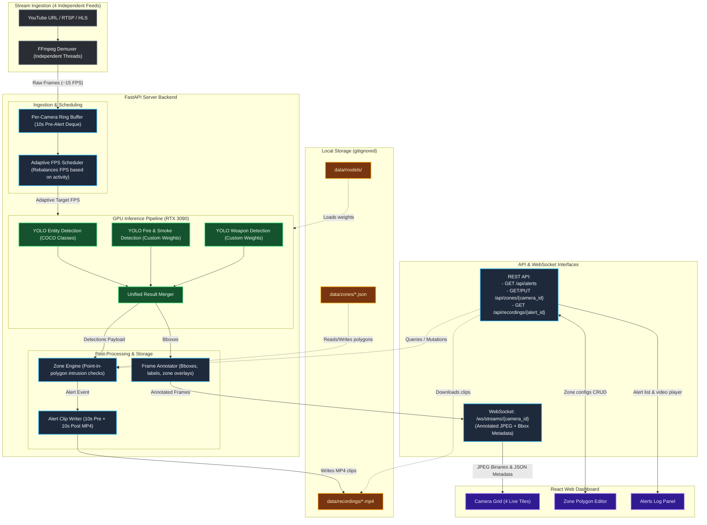

# Pipeline and Data Flow Architecture

This document details the visual and logical relationships between the **Stream Ingestion**, **Adaptive GPU Inference Pipeline**, and the **React Dashboard** as specified in the [PLAN.md](file:///c:/Programming/Projects/03_PROTOTYPE/rapideye_prototype/rapideye-demo/PLAN.md).

## Architecture Diagram

## Step-by-Step Flow Explanation

1. **Ingest Phase:** `FFmpeg` demuxes each input stream (YouTube, RTSP, or HLS) on its own separate thread. Raw frames are stored in a **10-second rolling RAM ring buffer** to capture pre-alert footage.
2. **Scheduling Phase:** The **Adaptive FPS Scheduler** looks at GPU load and recent detections to adjust the FPS budget dynamically across all 4 cameras.
3. **Inference Pipeline:** Frames are passed to the GPU (RTX 3090) to run through three YOLO models:
   * **Entity Model:** Detects humans, cars, animals, etc.
   * **Fire Model:** Detects active fire and smoke (loaded via `torch.hub`).
   * **Weapon Model:** Detects pistols, rifles, knives, etc.
4. **Result Merging & Zone Analysis:** The detections are merged. The **Zone Engine** tests if class centroids lie inside the user-configured polygon. If a person, fire, or weapon triggers the zone boundary:
   * An alert is fired.
   * **Alert Clip Writer** extracts the pre-alert frames from the ring buffer, captures the next 10 seconds of post-alert footage, and writes a `.mp4` file to local storage.
5. **Annotation & WebSocket Stream:** The **Frame Annotator** renders color-coded bounding boxes (e.g., orange for fire, red for weapons, green for safe zones) and writes the output frame to a JPEG binary streamed live over WebSockets to the React frontend.
6. **Frontend Experience:** The React client displays a 2x2 grid updating at target FPS, lets administrators draw zone polygons via the **Zone Editor**, and alerts them instantly with clip-playback links in the **Event Log**.
